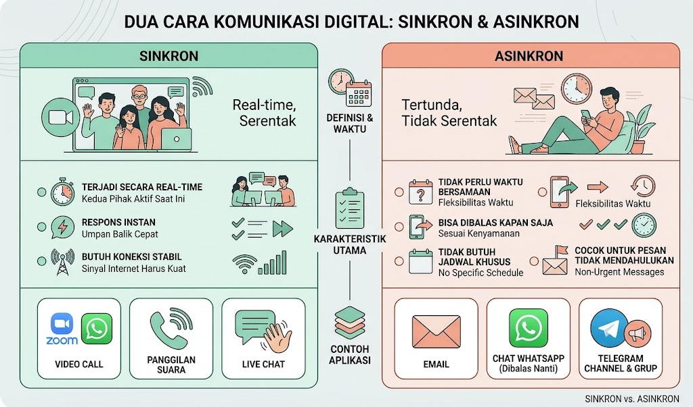

  <h3 class="text-indigo-800 m-0 mb-3 flex items-center gap-2">🎯 Tujuan Pembelajaran</h3>
  <ul class="text-indigo-900 m-0 text-sm">
    <li>Menggunakan macam-macam aplikasi media komunikasi yang dapat digunakan  secara bersamaan dengan baik.</li>
  </ul>

Media komunikasi adalah alat atau aplikasi yang digunakan untuk menyampaikan  dan bertukar informasi dari pengirim kepada penerima informasi. Ketika komunikasi ini dilakukan melalui aplikasi atau internet, kita menyebutnya komunikasi virtual atau **komunikasi daring** (dalam jaringan).

---

## Jenis-Jenis Komunikasi Digital

Berdasarkan waktu penyampaian dan penerimaan informasi, komunikasi daring terbagi menjadi dua jenis:

### 1. Komunikasi Sinkron (*Real-time*)
Komunikasi yang terjadi secara bersamaan pada waktu yang sama. Pengirim dan penerima informasi berinteraksi secara langsung tanpa jeda waktu yang lama.
* *Contoh:* Panggilan telepon, *Video Conference* (Zoom, Google Meet), dan *Live Chat*.

### 2. Komunikasi Asinkron (Tertunda)
Komunikasi yang tidak terjadi secara bersamaan. Pesan dikirimkan oleh pengirim dan dapat dibaca serta dibalas pada waktu yang berbeda oleh penerima.
* *Contoh:* Surat Elektronik (Email), Forum Diskusi, dan Sistem Tiket (*Helpdesk*).

---

## Aplikasi Komunikasi Digital yang Umum Digunakan di Indonesia

| Aplikasi | Fungsi Utama | Status/Relevansi Saat Ini |
|---|---|---|
| **WhatsApp** | Chat, kirim file, voice call, video call, panggilan grup — tersedia di smartphone maupun desktop | Aplikasi pesan paling dominan di Indonesia, dipakai untuk komunikasi personal maupun bisnis (WhatsApp Business) |
| **Telegram** | Chat, kirim file besar, channel, bot | Masih banyak dipakai, terutama untuk grup besar, channel informasi, dan berbagi file berukuran besar |
| **Instagram DM** | Chat langsung dari aplikasi media sosial | Semakin sering dipakai anak muda sebagai kanal chat utama, menggantikan sebagian fungsi yang dulu diisi Line |
| **Google Meet** | Video conference, terintegrasi dengan akun Google/Gmail | Masih jadi pilihan utama untuk rapat daring, terutama di lingkungan pendidikan dan kantor yang memakai Google Workspace |
| **Zoom Meeting** | Video conference dengan kapasitas peserta besar | Masih relevan, banyak dipakai untuk webinar, kelas daring, dan rapat besar |
| **Microsoft Teams** | Chat, video conference, kolaborasi dokumen dalam satu aplikasi | Semakin relevan karena kini menjadi platform komunikasi utama Microsoft (lihat catatan di bagian 3) |

> Dari daftar di atas, tiga aplikasi yang paling sering dipraktikkan penggunaannya di sekolah/kantor adalah **WhatsApp**, **Google Meet**, dan **Zoom Meeting**.

    <h4 class="text-blue-800 m-0 mb-2 flex items-center gap-2">📝 Catatan Pembaruan:</h4>
    <h5 class="text-blue-800 m-0 mb-2 flex items-center gap-2">Aplikasi yang Sudah Tidak Relevan</h5>
    
Materi asli buku ini (diterbitkan 2023) juga mencantumkan <strong class="text-blue-900">Line</strong> dan <strong class="text-blue-900">Skype</strong> sebagai contoh aplikasi komunikasi. Berikut konteks mengapa keduanya sudah kurang relevan dijadikan contoh utama saat ini: 

        <ul class="text-blue-900 text-sm m-0">
            <li><strong class="text-blue-900">Skype</strong> — Microsoft resmi <em>menghentikan seluruh layanan Skype pada 5 Mei 2025</em>. Pengguna diarahkan untuk beralih ke Microsoft Teams versi gratis, dan seluruh kontak serta riwayat chat dipindahkan secara otomatis. Dengan demikian, Skype tidak lagi bisa dijadikan contoh aplikasi komunikasi yang aktif digunakan.</li>
            <li><strong class="text-blue-900">Line</strong> — meskipun aplikasinya masih bisa diunduh dan dipakai, popularitasnya di Indonesia terus menurun sejak pertengahan 2010-an akibat dominasi WhatsApp dan Telegram. Ditambah lagi, sejumlah fitur andalan Line di Indonesia sudah dihentikan satu per satu: Line Today (2022), Line OpenChat (2022), Line Jobs (2022), Line VOOM (Februari 2025), Line Notify (Maret 2025), hingga fitur Split Bill (Juli 2025). Saat ini Line hanya bertahan di kalangan pengguna niche tertentu (misalnya komunitas atau grup lama), bukan lagi aplikasi komunikasi arus utama.</li>
        </ul>
    
Sebagai gantinya, materi di atas menampilkan <strong class="text-blue-900">Instagram DM</strong> dan <strong class="text-blue-900">Microsoft Teams</strong> sebagai contoh yang lebih mencerminkan pola komunikasi digital masyarakat Indonesia saat ini.

    <h4 class="text-green-800 m-0 mb-2 flex items-center gap-2">💡 Insight Industri</h4>
    
Di lingkungan kerja profesional seperti <i>software development</i>, komunikasi tim jarang menggunakan WhatsApp. Perusahaan biasanya menggunakan platform komunikasi berbasis <i>channel</i> terpusat seperti <strong class="text-green-900">Slack</strong>, <strong class="text-green-900">Discord</strong>, atau <strong class="text-green-900">Microsoft Teams</strong>. Tujuannya agar riwayat diskusi teknis mudah dicari dan tidak tercampur dengan urusan pribadi.

## Praktik Penggunaan Aplikasi

### A. WhatsApp — Melakukan Panggilan Grup

1. Buka aplikasi WhatsApp, lalu masuk ke tab **Panggilan (Calls)**.
2. Ketuk ikon telepon dengan tanda "+" untuk memulai panggilan baru.
3. Pilih **Panggilan grup baru (New group call)**.
4. Pilih kontak-kontak yang ingin diajak bergabung, lalu mulai panggilan (suara atau video).

### B. Google Meet — Membuat/Menjadwalkan Rapat

1. Buka Gmail, klik ikon **Google Apps**, lalu pilih **Meet**.
2. Klik **Rapat baru (New meeting)**.
3. Pilih salah satu opsi: membuat rapat langsung, menjadwalkan di Google Calendar, atau membuat tautan untuk dibagikan nanti.
4. Setelah rapat dibuat, tautan (link) rapat dapat dibagikan kepada peserta melalui chat, email, atau kanal lain.

### C. Zoom Meeting — Menjadwalkan Rapat

1. Buka aplikasi Zoom di laptop atau smartphone, lalu **Sign In** (bisa menggunakan SSO, akun Google, akun Microsoft, dll).
2. Setelah masuk, pilih **Schedule** untuk membuat rapat baru.
3. Isi judul rapat, tanggal, serta waktu mulai dan berakhirnya rapat, lalu klik **Done/Save**.
4. Pilih **Invite** untuk mengundang peserta — undangan bisa dikirim melalui email, SMS, atau aplikasi chat lain.

---

## Teknik Teknis Multitasking Antar Aplikasi
 
- **Gunakan versi desktop/web**, bukan hanya di HP. WhatsApp Web, Telegram Desktop, Google Meet, dan Zoom Desktop App bisa dibuka bersamaan di satu laptop tanpa harus bolak-balik pindah perangkat.
- **Atur banyak jendela/tab sekaligus** — misalnya jendela Zoom untuk rapat di sisi kiri layar, dan tab WhatsApp Web di sisi kanan (split screen), sehingga kedua aplikasi bisa dipantau bersamaan.
- **Kelola notifikasi** — matikan notifikasi bunyi pada aplikasi yang sedang tidak prioritas (misalnya saat sedang di rapat Zoom, silent-kan notifikasi Instagram), agar tidak mengganggu fokus namun tetap bisa dicek sewaktu-waktu.
- **Manfaatkan fitur "mute" dan "do not disturb"** pada aplikasi chat ketika sedang aktif di aplikasi video conference, supaya tidak ada tabrakan suara/notifikasi.
- **Gunakan HP dan laptop secara bersamaan** jika perlu — misalnya ikut rapat Google Meet dari laptop, sambil memegang HP untuk membalas WhatsApp grup tugas.

### Matriks: Kapan Memakai Aplikasi Apa
 
| Kebutuhan | Aplikasi yang Cocok | Alasan |
|---|---|---|
| Koordinasi cepat, informal, sehari-hari | WhatsApp | Paling banyak dipakai, responsnya cepat |
| Berbagi file besar / dokumentasi grup besar | Telegram | Batas ukuran file lebih besar, cocok untuk channel/grup besar |
| Rapat terjadwal dengan banyak peserta | Google Meet / Zoom | Fitur video conference lebih matang, ada fitur rekaman & jadwal |
| Kolaborasi dokumen sambil chat/rapat dalam satu aplikasi | Microsoft Teams | Chat, video call, dan dokumen kerja tergabung dalam satu tempat |
| Komunikasi santai dengan komunitas/circle pertemanan | Instagram DM | Terintegrasi dengan aktivitas media sosial sehari-hari |

## Rangkuman

- Komunikasi digital di Indonesia saat ini didominasi oleh **WhatsApp** (chat & panggilan sehari-hari), **Telegram** (grup besar & file), serta **Google Meet** dan **Zoom** (rapat/video conference).
- **Microsoft Teams** kini menggantikan posisi Skype sebagai layanan komunikasi resmi Microsoft.
- **Line** dan **Skype** yang dulu sering dijadikan contoh di materi pembelajaran, kini sudah kurang mencerminkan kebiasaan komunikasi digital masyarakat Indonesia — Skype bahkan sudah resmi tidak beroperasi sejak Mei 2025.
- Kemampuan **menggunakan beberapa aplikasi komunikasi secara bersamaan** (multitasking) adalah keterampilan inti yang perlu dilatih, bukan sekadar mengetahui cara pakai tiap aplikasi satu per satu.
